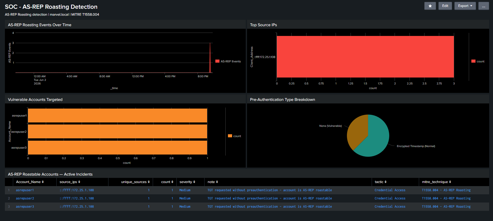

# AS-REP Roasting Detection

**MITRE ATT&CK:** T1558.004 – AS-REP Roasting\
**Tactic:** Credential Access\
**Data Source:** Windows Security Event Logs\
**Event ID:** 4768 (Kerberos Authentication Ticket Requested)\
**Pre-Authentication Type:** 0 (No Preauthentication Required)\
**Severity:** Medium / High / Critical (Threshold-Based)\
**Index:** winserver2019

---

## Description

AS-REP Roasting targets Active Directory accounts that have Kerberos preauthentication disabled (`DoesNotRequirePreAuth = True`). An attacker can request a TGT for any such account without providing credentials, the DC responds with an AS-REP message encrypted with the account's password hash, which can then be cracked offline without any further interaction with the domain.

This detection identifies accounts receiving TGT responses without preauthentication by extracting `Pre-Authentication Type: 0` from Event ID 4768. Severity is dynamically assigned based on the number of requests observed — even a single event is significant since legitimate accounts should never have preauthentication disabled.

---

## ATT&CK Context

| ATT&CK Field     | Value                               |
| ---------------- | ----------------------------------- |
| Tactic           | Credential Access                   |
| Technique        | T1558.004 – AS-REP Roasting         |
| Data Source      | Windows Security Event Logs         |
| Event ID         | 4768                                |
| Pre-Auth Type    | 0 (No Preauthentication)            |
| Protocol         | Kerberos (TCP/88)                   |
| Detection Method | Pre-Authentication Type Correlation |

---

## Detection Query (SPL)

```spl
index=winserver2019 EventCode=4768
| rex field=_raw "Pre-Authentication Type:\s+(?<pre_auth_type>\d+)"
| where pre_auth_type="0"
| where Account_Name!="krbtgt" AND NOT Account_Name LIKE "%$"
| stats count, values(Client_Address) as source_ips, dc(Client_Address) as unique_sources by Account_Name
| eval severity=case(count>=5,"Critical", count>=3,"High", count>=1,"Medium")
| eval tactic="Credential Access"
| eval mitre_technique="T1558.004 - AS-REP Roasting"
| eval note="TGT requested without preauthentication - account is AS-REP roastable"
| sort -count
| table Account_Name, source_ips, unique_sources, count, severity, note, tactic, mitre_technique
```

# Splunk Dashboard Created


---

## Severity Thresholds

| Request Count | Severity |
|---------------|----------|
| >= 1          | Medium   |
| >= 3          | High     |
| >= 5          | Critical |

> Note: Even a single `Pre-Auth Type: 0` event should be investigated. No legitimate account should have preauthentication disabled in a hardened environment.

---

## Lab Setup
Run below command of step 1 and step 2 in DC as a administrator to setup accounts vulnerable to Asreproasting.

Step 1: Vulnerable Accounts Created

```powershell
$password = ConvertTo-SecureString "MYpassword123#" -AsPlainText -Force

New-ADUser -Name "asrepuser1" -SamAccountName "asrepuser1" -AccountPassword $password -PasswordNeverExpires $true -Enabled $true
New-ADUser -Name "asrepuser2" -SamAccountName "asrepuser2" -AccountPassword $password -PasswordNeverExpires $true -Enabled $true
New-ADUser -Name "asrepuser3" -SamAccountName "asrepuser3" -AccountPassword $password -PasswordNeverExpires $true -Enabled $true
```

Step 2: Disable Preauthentication (Makes Accounts Vulnerable)

```powershell
Set-ADAccountControl -Identity "asrepuser1" -DoesNotRequirePreAuth $true
Set-ADAccountControl -Identity "asrepuser2" -DoesNotRequirePreAuth $true
Set-ADAccountControl -Identity "asrepuser3" -DoesNotRequirePreAuth $true
```

---

## Attack Simulation

From Parrot OS attacker (172.25.1.10):

```bash
# Enumerate and request AS-REP hashes for all vulnerable accounts
impacket-GetNPUsers marvel.local/Administrator:'<Password-Here>' -dc-ip 172.25.1.102 -request

# Output: AS-REP hashes for asrepuser1, asrepuser2, asrepuser3
# Hash format: $krb5asrep$23$asrepuser1@MARVEL.LOCAL:...

# Crack offline with hashcat
hashcat -m 18200 hashes.txt /usr/share/wordlists/rockyou.txt
```

---

## Prerequisites

Enable Kerberos audit logging on the DC if Event ID 4768 is not appearing:

```cmd
auditpol /set /subcategory:"Kerberos Authentication Service" /success:enable /failure:enable

reg add "HKLM\SYSTEM\CurrentControlSet\Services\Kerberos\Parameters" /v LogLevel /t REG_DWORD /d 1 /f
```

> Note: `Pre-Authentication Type` is not extracted as a field by the Windows TA by default. This detection uses `rex` to extract it directly from the raw event.

---

## Alert Configuration

| Field             | Value                              |
|-------------------|------------------------------------|
| Name              | `SOC - AS-REP Roasting Alert`      |
| Schedule          | Every 5 minutes                    |
| Time Range        | Last 15 minutes                    |
| Trigger Condition | Number of results > 0              |
| Severity          | High                               |
| Action            | Add to Triggered Alerts            |

---

## Tuning Notes

- Any account with `Pre-Auth Type: 0` should be investigated regardless of count
- Whitelist known legacy service accounts that require preauthentication disabled
- Combine with T1558.003 (Kerberoasting) detections for full Kerberos attack coverage
- Consider enforcing preauthentication on all accounts via GPO as a remediation

## False Positives

- Legacy applications requiring preauthentication to be disabled
- Misconfigured service accounts
- Vulnerability scanners performing Kerberos enumeration

---

## Difference from Kerberoasting

| | AS-REP Roasting | Kerberoasting |
|---|---|---|
| MITRE | T1558.004 | T1558.003 |
| Event ID | 4768 | 4769 |
| Requires credentials | No | Yes |
| Target | Accounts without preauth | Accounts with SPNs |
| Hash type | `$krb5asrep$23$` | `$krb5tgs$23$` |
| Hashcat mode | 18200 | 13100 |

---

## References

- [MITRE ATT&CK T1558.004](https://attack.mitre.org/techniques/T1558/004/)
- [Windows Event ID 4768](https://www.ultimatewindowssecurity.com/securitylog/encyclopedia/event.aspx?eventID=4768)
- [Impacket GetNPUsers](https://github.com/fortra/impacket)
