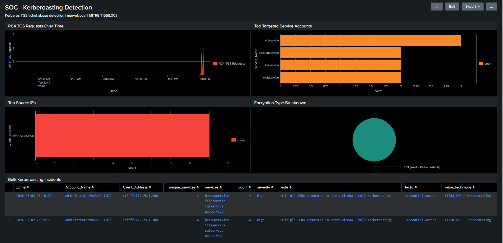

# Detection: Kerberoasting

## MITRE ATT&CK
**MITRE ATT&CK:** T1558.003 – Kerberoasting\
**Tactic:** Credential Access\
**Data Source:** Windows Security Event Logs\
**Event ID:** 4769 (Kerberos Service Ticket Requested)\
**Encryption Type:** 0x17 (RC4-HMAC — Weak, Kerberoastable)\
**Severity:** High / Critical (Threshold-Based)\
**Index:** winserver2019

## Description

Kerberoasting is an Active Directory attack technique where an authenticated user requests Kerberos TGS tickets for accounts with registered Service Principal Names (SPNs). The tickets are encrypted with the service account's password hash and can be cracked offline without any further interaction with the domain.

This detection identifies bulk TGS ticket requests using weak RC4 encryption (Ticket_Encryption_Type 0x17) targeting multiple service accounts within a short time window. Severity is dynamically assigned based on the number of unique SPNs requested, a pattern exclusively associated with tools like Impacket's GetUserSPNs.

## ATT&CK Context

| ATT&CK Field     | Value                                         |
| ---------------- | --------------------------------------------- |
| Tactic           | Credential Access                             |
| Technique        | T1558 – Steal or Forge Kerberos Tickets       |
| Sub-Technique    | T1558.003 – Kerberoasting                     |
| Data Source      | Windows Security Event Logs                   |
| Event ID         | 4769                                          |
| Ticket Type      | Kerberos Service Ticket (TGS) Request         |
| Encryption Type  | RC4-HMAC (0x17)                               |
| Detection Method | Threshold-Based Correlation                   |


## Log Source
- **Index:** winserver2019
- **Event ID:** 4769 (A Kerberos service ticket was requested)
- **Key Field:** Ticket_Encryption_Type = 0x17

### Severity Mapping
| Unique SPNs (5 min window) | Severity |
|----------------------------|----------|
| >= 5 | Critical |
| >= 3 | High |

## Service Accounts Created for Simulation
| Account | SPN |
|---------|-----|
| sqlservice | MSSQLSvc/winserver2019.marvel.local:1433 |
| webservice | HTTP/webserver.marvel.local:80 |
| backupservice | BackupAgent/backup.marvel.local:8082 |
| fileservice | CIFS/fileserver.marvel.local:445 |
| monitorservice | SNMP/monitor.marvel.local:161 |


## Kerberoastable account setup
Run below command of step 1 and step 2 in DC as a administrator to setup accounts vulnerable to kerberoasting.

Step 1: Create all service accounts:
```powershell
$password = ConvertTo-SecureString "MYpassword123#" -AsPlainText -Force

New-ADUser -Name "sqlservice" -SamAccountName "sqlservice" -AccountPassword $password -PasswordNeverExpires $true -Enabled $true
New-ADUser -Name "webservice" -SamAccountName "webservice" -AccountPassword $password -PasswordNeverExpires $true -Enabled $true
New-ADUser -Name "backupservice" -SamAccountName "backupservice" -AccountPassword $password -PasswordNeverExpires $true -Enabled $true
New-ADUser -Name "fileservice" -SamAccountName "fileservice" -AccountPassword $password -PasswordNeverExpires $true -Enabled $true
New-ADUser -Name "monitorservice" -SamAccountName "monitorservice" -AccountPassword $password -PasswordNeverExpires $true -Enabled $true
```
Step 2: Register SPNs for each
```powershell
setspn -A MSSQLSvc/winserver2019.marvel.local:1433 marvel\sqlservice
setspn -A HTTP/webserver.marvel.local:80 marvel\webservice
setspn -A BackupAgent/backup.marvel.local:8082 marvel\backupservice
setspn -A CIFS/fileserver.marvel.local:445 marvel\fileservice
setspn -A SNMP/monitor.marvel.local:161 marvel\monitorservice
```

## Attack Simulation
From Parrot OS attacker (172.25.1.10):

```bash
# Request TGS tickets for all SPN accounts
impacket-GetUserSPNs marvel.local/Administrator:'<Password-Here>' -dc-ip 172.25.1.102 -request

# Output: TGS hashes for all 5 service accounts
# Hash format: $krb5tgs$23$*sqlservice*...
# Crack offline with hashcat:
hashcat -m 13100 hashes.txt /usr/share/wordlists/rockyou.txt
```


---
## SPL Query for Detection
```
index=winserver2019 EventCode=4769 Ticket_Encryption_Type=0x17
| where Service_Name!="krbtgt" AND NOT Service_Name LIKE "%$"
| bucket _time span=5m
| stats dc(Service_Name) as unique_services, values(Service_Name) as services, count by _time, Account_Name, Client_Address
| where unique_services >= 3
| eval severity=case(unique_services>=5,"Critical", unique_services>=3,"High")
| eval tactic="Credential Access"
| eval mitre_technique="T1558.003 - Kerberoasting"
| eval note="Multiple SPNs requested in short window - bulk Kerberoasting"
| sort -unique_services
| table _time, Account_Name, Client_Address, unique_services, services, count, severity, note, tactic, mitre_technique
```

## Splunk Dashboard Created



## Why RC4 is the Signal
Impacket requests RC4 (0x17) tickets by default because RC4 hashes are faster to crack than
AES256 (0x12). A legitimate application would never request RC4 tickets for 5 different
service accounts within seconds, that pattern is exclusively attacker behavior.

## Tuning Notes
- Whitelist known monitoring tools that legitimately request multiple TGS tickets
- Adjust threshold from 3 to 2 in high-sensitivity environments
- Combine with 4768 (TGT requests) to track full Kerberos attack chain
- Consider alerting on ANY RC4 ticket request in environments that have enforced AES-only policy

## False Positives
- Legacy applications that still use RC4 (older SQL Server, IIS configurations)
- Vulnerability scanners performing Kerberos enumeration
- Penetration testing activity (should be whitelisted by source IP during engagements)

## References
- https://attack.mitre.org/techniques/T1558/003/
- https://www.ultimatewindowssecurity.com/securitylog/encyclopedia/event.aspx?eventID=4769
