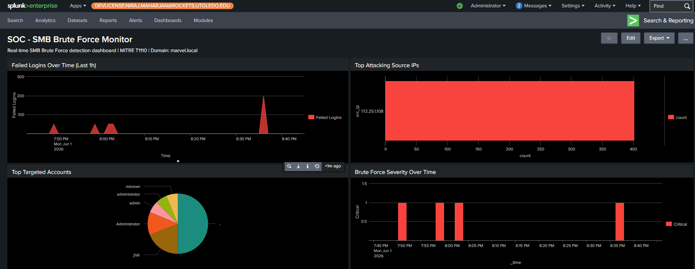
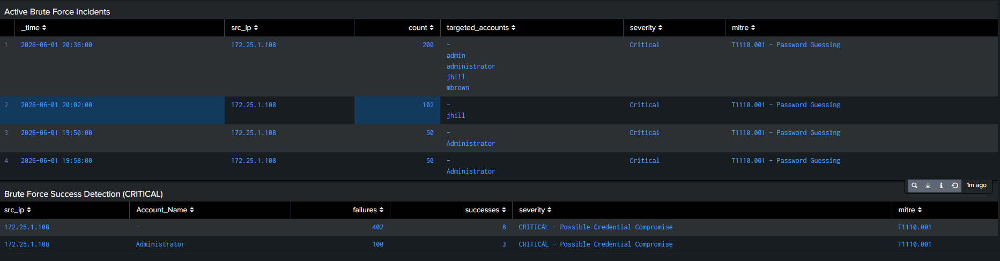

# Detection: SMB Brute Force

**MITRE ATT&CK:** T1110 – Brute Force\
**Sub-Technique:** T1110.001 – Password Guessing\
**Tactic:** Credential Access\
**Data Source:** Windows Security Event Logs\
**Event ID:** 4625 (Failed Logon)\
**Logon Type:** 3 (Network Logon)\
**Severity:** Medium / High / Critical (Threshold-Based)\
**Index:** winserver2019

---

## Description

SMB brute-force attacks attempt to gain unauthorized access by repeatedly trying passwords against a target account over the SMB protocol (TCP/445). These attacks generate multiple failed network authentication events in Windows Security logs.

This detection identifies source IP addresses generating excessive failed network logons (Event ID 4625, Logon Type 3) within a short time period. Severity is dynamically assigned based on the number of failed attempts observed.

---

## ATT&CK Context

| ATT&CK Field     | Value                         |
| ---------------- | ----------------------------- |
| Tactic           | Credential Access             |
| Technique        | T1110 – Brute Force           |
| Sub-Technique    | T1110.001 – Password Guessing |
| Data Source      | Windows Security Event Logs   |
| Event ID         | 4625                          |
| Logon Type       | 3 (Network Logon)             |
| Protocol         | SMB (TCP/445)                 |
| Detection Method | Threshold-Based Correlation   |

### Why This Detection Matters

Brute-force attacks remain one of the most common techniques used by attackers to obtain valid credentials. Repeated failed authentication attempts against SMB services may indicate password guessing, automated credential attacks, or attempts to gain initial access to a Windows environment.

Monitoring Event ID 4625 with Logon Type 3 provides visibility into failed network authentication attempts and enables defenders to identify suspicious activity before an attacker successfully compromises an account.

---

## Detection Logic

1. Monitor Windows failed authentication events (Event ID 4625).
2. Filter for Logon Type 3 (Network Logon).
3. Group events into 2-minute time windows.
4. Count failed authentication attempts by source IP and target account.
5. Generate an alert when failures exceed 10 attempts.
6. Assign severity based on attack volume.

### Severity Mapping

| Failed Attempts | Severity |
| --------------- | -------- |
| 10 - 19         | Medium   |
| 20 - 29         | High     |
| 30+             | Critical |

---

## SPL Query

```spl
index=winserver2019 EventCode=4625 Logon_Type=3
| bucket _time span=2m
| stats count by _time, Account_Name, src_ip
| where count >= 10
| eval severity=case(
    count>=30,"Critical",
    count>=20,"High",
    count>=10,"Medium"
)
| sort -count
| table _time, src_ip, Account_Name, count, severity
````

---

## Alert Configuration

| Setting           | Value                    |
| ----------------- | ------------------------ |
| Schedule          | Every 5 minutes          |
| Trigger Condition | Number of Results > 0    |
| Throttle          | 10 Minutes per Source IP |
| Severity          | Dynamic (SPL Eval Field) |

---

## Attack Simulation

The attack was simulated from a Parrot OS system using NetExec (`nxc`) against the Domain Controller's SMB service.

### Attack Command

```bash
nxc smb 172.25.1.102 -u Administrator -p wordlist.txt --shares
```

### Attack Objective

Attempt multiple password guesses against the Administrator account over SMB until valid credentials are identified.

### Result

The brute-force attack successfully generated multiple Event ID 4625 failed authentication events and triggered the Splunk detection rule once the configured threshold was exceeded.

## Splunk Dashboard Created





---

## Detection Validation

### Expected Behavior

* Failed SMB authentication attempts generate Event ID 4625.
* Detection groups events into 2-minute windows.
* Alert triggers when failures exceed 10 attempts.
* Severity increases as the number of failures grows.

### Validation Outcome

- Event ID 4625 successfully generated during attack simulation.
- Detection triggered after threshold was exceeded.
- Source IP address correctly identified.
- Target account successfully identified.
- Alert severity assigned according to configured thresholds.


---

## False Positive Considerations

| Scenario                        | Potential Cause                          | Mitigation                          |
| ------------------------------- | ---------------------------------------- | ----------------------------------- |
| Misconfigured Service Account   | Incorrect stored credentials             | Whitelist known service accounts    |
| User Password Mistypes          | Multiple login failures by user          | Increase threshold or exclude users |
| Password Synchronization Issues | Cached credentials after password change | Temporary threshold adjustment      |
| Vulnerability Scanners          | Automated authentication testing         | Exclude scanner IP ranges           |

---

## Threshold Tuning Notes

* Threshold set to 10 failures within 2 minutes to reduce false positives.
* Logon Type 3 isolates network authentication attempts associated with SMB activity.
* Thresholds should be adjusted based on normal authentication volume within the environment.
* Service accounts and scanner systems may require exclusions.

Example exclusion:

```spl
| where Account_Name!="svc_backup"
| where Account_Name!="ANONYMOUS LOGON"
```

---

## Detection Limitations

* Does not detect successful brute-force activity without Event ID 4624 correlation.
* Low-and-slow attacks may remain below the threshold.
* Distributed attacks using multiple source IPs may evade detection.
* Requires Windows Security logging to be enabled and ingested into Splunk.


## References

* MITRE ATT&CK T1110: https://attack.mitre.org/techniques/T1110/
* Microsoft Event ID 4625 Documentation: https://learn.microsoft.com/


